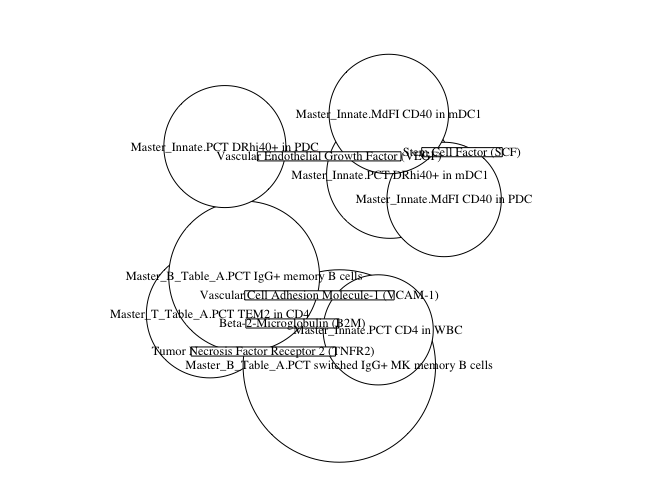

EM131 Fig6
================
Slim FOURATI
12/09/2014

load require libraries

``` r
suppressPackageStartupMessages(library(package = "knitr"))
suppressPackageStartupMessages(library(package = "Biobase"))
suppressPackageStartupMessages(library(package = "gdata"))
suppressPackageStartupMessages(library(package = "mixOmics501"))
suppressPackageStartupMessages(library(package = "impute"))
suppressPackageStartupMessages(library(package = "pwr"))
suppressPackageStartupMessages(library(package = "igraph"))
suppressPackageStartupMessages(library(package = "limma"))
suppressPackageStartupMessages(library(package = "reshape"))
suppressPackageStartupMessages(library(package = "readxl"))
library(package = "readr")
```

set session options

``` r
knitr::opts_chunk$set(echo = TRUE) # do not echo chunks
opts_chunk$set(tidy = FALSE, fig.path = "../figure/")
options(dplyr.summarise.inform = FALSE,
        stringsAsFactors = FALSE)
workDir <- workDir <- dirname(getwd())
```

read gene-expression data

``` r
load(file = file.path(workDir, "input/eset.RData"))
    rownames(fData(eset)) <- fData(eset)$"Probe.Set.ID"

# use only V2 sample
esetV2 <- eset[, grep(pattern = "V2", eset$"Sample Name")]
exprsMat <- exprs(esetV2)

# average duplicate
id <- esetV2$"Sample Name"
names(id) <- colnames(exprs(esetV2))
id <- unstack(stack(id)[, 2:1])
exprsMat <- sapply(id, FUN = function(x) {
  rowMeans(exprsMat[, x, drop = FALSE])
})

# subset only on training set samples
fileName <- "20120924_Merck.randomization.listPatientID.txt"
randomisationTab <- read.table(file = file.path(workDir,
                                                    "input",
                                                    fileName),
                                   sep = "\t",
                                   row.names = 1)
pts2set <- strsplit(randomisationTab[, "V2"], split = ",")
names(pts2set) <- rownames(randomisationTab)
# print patients ID affected to training/test sets
pts2set <- stack(pts2set)
sample2set <- pData(eset)[match(colnames(exprsMat),
                                    table = eset$"Sample Name"), "Subject ID"]
sample2set <- match(sample2set, table = pts2set$"values")
sample2set <- pts2set[sample2set, "ind"]

# use expression matrix of training set
exprsMat <- exprsMat[, sample2set %in% "training"]
```

read FACS data

``` r
fileName <- "20130212_MK131_Flow.xlsx"
fileName <- file.path(workDir, "input", fileName)
  nbSheet <- excel_sheets(path = fileName)
  flowLS <- lapply(nbSheet, FUN = function(x) {
    flowDF <- read_excel(path        = fileName,
                            sheet       = x)
    flowDF <- as.data.frame(flowDF)
  })
  names(flowLS) <- gsub(pattern     = " ",
                        replacement = "_",
                        nbSheet)
  flowLS <- lapply(flowLS, FUN = function(x) {
    rownames(x) <- apply(x[, c("Subject ID", "Visit")],
                         MARGIN   = 1,
                         FUN      = paste,
                         collapse = "_")
    rownames(x) <- paste("NIML", rownames(x), sep = "_")
    return(value = x)
  })
  rowNames <- rownames(flowLS[[1]])
  flowLS <- lapply(flowLS, FUN = function(x) {
    return(value = x[rowNames, ])
  })
                                        # boolean table exclude from analysis
  flowLS <- flowLS[!grepl(pattern = "boolean", names(flowLS))]
                                        # clean up
  cat("removing technical replicates...")
```

    ## removing technical replicates...

``` r
  flowLS <- lapply(flowLS, FUN = function(x) {
    return(value = x[!grepl(pattern = "_B$", rownames(x)), ])
  })
                                        # creating one data frame for all the FACS measures
  flowDF <- lapply(flowLS, FUN = function(x) {
    return(value = x[, -(1:6)])
  })
  flowDF <- do.call(what = cbind, args = flowDF)
                                        # clean up


  # subset flow data on samples in common with gene-expression
    flowDF <- t(flowDF[colnames(exprsMat), ])
```

read cytokine data

``` r
  fileName <- c("MK0000-131_RBM Results first 120.xls",
                "MK0000-131_RBM Results final 54.xls")
  cytoDF <- lapply(fileName, FUN = function(x) {
    DF <- read.xls(xls         = file.path(workDir, "input", x),
                   sheet       = 2,
                   check.names = FALSE,
                   row.names   = 1)
    return(value = DF)
  })
  cytoDF <- do.call(what = rbind, args = cytoDF)
  rowNames <- strsplit(rownames(cytoDF), split = " ")
  rowNames <- do.call(what = rbind, args = rowNames)
  batch <- rowNames[, 3]
  rowNames <- apply(rowNames[, -3], MARGIN = 1, FUN = paste, collapse = "_")
  rowNames <- paste("NIML", rowNames, sep = "_")
  rownames(cytoDF) <- rowNames
  dimNames <- dimnames(cytoDF)
  # copy with <LOW> values replaced by minimum(value)/2
  imputeDF <- cytoDF
  imputeDF <- apply(imputeDF, MARGIN = 2, FUN = function(x) {
    xhat <- as.numeric(x)
    xmin <- min(xhat, na.rm = TRUE)
    if(!is.infinite(xmin)) {
      xhat[is.na(xhat)] <- xmin/2
    }
    return(value = xhat)
  })
  dimnames(imputeDF) <- dimNames
  # copy of cytoDF with <LOW> replaced by NA
  cytoDF <- apply(cytoDF, MARGIN = 2, FUN = as.numeric)
  dimnames(cytoDF) <- dimNames
  # clean up
  rm(list = c("fileName", "rowNames", "dimNames"))
  # read array annotation and extract set information
  arraysAnnot <- pData(eset)
  set <- arraysAnnot[!is.na(arraysAnnot$"Assay_Array Barcode") &
                     grepl(pattern = "V2",
                           arraysAnnot$"Sample Name"),
                     c("Sample Group Name", "Sample Name")]
  set <- set[match(rownames(cytoDF), table = set$"Sample Name"), ]
  set <- grepl(pattern = "2nd", set$"Sample Group Name")
  set <- c("1st", "2nd")[as.numeric(set) + 1]
  # scaling to remove batch effect
  imputeDF[set %in% "1st"] <- scale(imputeDF[set %in% "1st", ])
  imputeDF[set %in% "2nd"] <- scale(imputeDF[set %in% "2nd", ])
  cytoDF[set %in% "1st"] <- scale(cytoDF[set %in% "1st", ])
  cytoDF[set %in% "2nd"] <- scale(cytoDF[set %in% "2nd", ])
  cytoDF <- as.data.frame(cytoDF)
  # subset on gene-expression samples
  cytoDF <- t(cytoDF[colnames(exprsMat), ])
```

read bioage data

``` r
fileName <- "20140410_GoringHH.bioage.txt"
    clusterDF <- read.table(file   = file.path(workDir, "input", fileName),
                            header = TRUE)
    clusterDF <- unstack(clusterDF[, c("SYMBOL", "cluster")])
    # remove unannoted probes
    clusterDF <- lapply(clusterDF, FUN = setdiff, y = "---")
    clusterPbs <- sapply(clusterDF, FUN = function(gene) {
      probe <- fData(eset)[fData(eset)$Gene.Symbol %in% gene, "Probe.Set.ID"]
      return(value = probe)
    })
```

calculate bioage

``` r
metaScore <- t(sapply(clusterPbs, FUN = function(pbs) {
      mat <- exprsMat[pbs, ]
      mat <- t(scale(t(mat)))
      return(value = colMeans(mat))
    }))

    bioage <- apply(metaScore, MARGIN = 2, FUN = function(x) {
      # bioage = ave(MG12:20) – ave(MG1:11)
      return(value = mean(x[12:20]) - mean(x[1:11]))
    })
```

read 15-gene sig

``` r
  listDF <- scan(file  = file.path(workDir, "input",
                                   "hepb_limma.15gene.txt"),
                 what  = "raw",
                 quiet = TRUE)
```

read hematologic data

``` r
fileName <- "RBC_Hcrit_Hemoglb.csv"
  rbcDF <- read.csv(file = file.path(workDir, "input",
                        "RBC_Hcrit_Hemoglb.csv"))
  ptsID <- gsub(pattern     = "NIML_([0-9]+)_V2",
                replacement = "\\1",
                colnames(exprsMat))
  rbcDF <- melt(rbcDF[, c("AN_NUM", "PRSDTLTM", "TEST", "RESULT")],
                   id = c("AN_NUM", "TEST", "PRSDTLTM"))
  rbcDF <- cast(data = rbcDF, formula = AN_NUM ~ PRSDTLTM + TEST)
  rbcDF <- rbcDF[match(ptsID, table = rbcDF$AN_NUM), ]
  rbcDF <- rbcDF[, grep(pattern = "^Visit 1", colnames(rbcDF))]
  rNames <- colnames(rbcDF)
  rbcDF <- t(rbcDF)
  rownames(rbcDF) <- rNames
  colnames(rbcDF) <- colnames(exprsMat)
```

performing mixomics

``` r
# impute missing values and subset on variables of interest
#   flow data
    flowDF2 <- impute.knn(as.matrix(flowDF))$data
    varInterest <- c(37, 61, 70, 79, 90, 91, 95, 98)
    flowDF2 <- flowDF2[varInterest, ]
    # cytokine data
    suppressWarnings(cytoDF2 <- impute.knn(as.matrix(cytoDF))$data)
    varInterest <- c(3, 20, 23, 39, 43, 44, 46)
    cytoDF2 <- cytoDF2[varInterest, ]
    # hematologic data
    varInterest <- 3
    rbcDF2 <- rbcDF[varInterest, , drop = FALSE]

  # create list of intereset
    geneLS <- clusterPbs[c(1, 16)]
    geneLS[["15"]] <- listDF

  # perform mixomics between genes and flow and cyto
  for (geneName in names(geneLS)) { 
    matPred <- exprsMat[geneLS[[geneName]], ]
    rNames<- fData(eset)[rownames(matPred), "Gene.Symbol"]
    flag <- which(rNames %in% "---")
    rNames[flag] <- fData(eset)[rownames(matPred)[flag], "Gene.Title"]
    rownames(matPred) <- make.unique(rNames)
    for (dName in c("flowDF2", "cytoDF2", "rbcDF2")) {
      print(paste(geneName, dName))
      eval(parse(text = paste("matResp <-", dName)))
      # identify the number of composent by 10-fold CV
      nComp <- nrow(matPred)
      splsFit <- spls(X     = t(matPred),
                      Y     = t(matResp),
                      ncomp = nComp,
                      mode  = "regression")
      set.seed(seed = 3)
      splsCV <- try(valid(splsFit,
                          validation = "Mfold",
                          folds      = 10),
                    silent = TRUE)
      while ("try-error" %in% class(splsCV)) {
        nComp <- nComp - 1
        # print(nComp)
        splsFit <- spls(X     = t(matPred),
                        Y     = t(matResp),
                        ncomp = nComp,
                        mode  = "regression")
        set.seed(seed = 3)
        splsCV <- try(valid(splsFit,
                            validation = "Mfold",
                            folds      = 10),
                      silent = TRUE)
      }
      nComp <- sum(splsCV$Q2.total > 0, na.rm = TRUE)
      splsFit <- spls(X     = t(matPred),
                      Y     = t(matResp),
                      ncomp = nComp,
                      mode  = "regression")
      threshold <- pwr.r.test(n         = ncol(matResp),
                              sig.level = 0.95,
                              power     = 0.99)
      # plot network
           fileName <- paste("net",
                        geneName,
                        gsub(pattern     = "([a-z]).+",
                             replacement = "\\1",
                             dName),
                        ".pdf",
                        sep = "")

         net <- network(splsFit,
                     comp = 1:nComp,
                     threshold = threshold$r,
                     show.color.key=FALSE)

      # modify igraph object
      if (any(E(net$gR)$weight < 0)) {
        gR <- net$gR
        gR <- subgraph.edges(graph = gR,
                             eids  = which(E(gR)$weight < 0),
                             delete.vertices = TRUE)
        #   correct label of vertices
        label <- V(gR)$label
        label <- gsub(pattern = "\\.[0-9]", replacement = "", label)
        label <- gsub(pattern     = "^Master_[^\\.]+\\.(.+)$",
                      replacement = "\\1",
                      label)
        label <- gsub(pattern = "PCT |MdFI ", replacement = "", label)
        V(gR)$label <- label
        #   remove duplicate vertices
        gR <- induced.subgraph(graph = gR,
                               vids  = which(!duplicated(label)))
        #   color vertices by fold change
        load(file = file.path(workDir, "input/fits.RData"))
        top <- topTable(fits[["Hepb_V2"]][["fit2"]], coef = 2, number = Inf)
        Symbol <- top$SYMBOL
        Symbol[Symbol %in% "---"] <- top[Symbol %in% "---", "Gene.Title"]
        logFC <- top[match(V(gR)$label, table = Symbol), "logFC"]
        colorPalette <- c("#D73027", "#FC8D59", "#FEE090", "#FFFFFF",
                          "#E0F3F8", "#91BFDB", "#4575B4")
        colorPalette <- colorRampPalette(colors = rev(colorPalette))(10)
        breaks <- c(-10,
                    seq(from = -0.5, to = 0.5, length.out = 9),
                    10)
        keyColor <- findInterval(logFC, vec = breaks, all.inside = TRUE)
        keyColor <- colorPalette[keyColor]
        keyColor[is.na(keyColor)] <- "#D3D3D3"
        V(gR)$color <- keyColor
        fileName2 <- gsub(pattern = "pdf", replacement = "v2.pdf", fileName)
        #plot(gR)
        eval(parse(text = paste(gsub(pattern     = ".pdf",
                                     replacement = "",
                                     fileName2),
                                "<- gR")))
      }
      # extract correlation matrix
        simMat <- net$simMat
        if (dName %in% "rbcDF2")
          colnames(simMat) <- rownames(rbcDF2)
        simMat[abs(simMat) < threshold$r] <- 0
        simLS <- apply(simMat, MARGIN = 2, FUN = function(x) {
          xNames <- names(x)
          xNames <- gsub(pattern = "\\.[0-9]", replacement = "", xNames)
          xId <- which(x != 0)
          return(value = cbind(xNames[xId], x[xId]))
        }, simplify = FALSE)
        yName <- rep(names(simLS), times = sapply(simLS, FUN = nrow))
        simDF <- do.call(what = rbind, args = simLS)
        simDF <- cbind(simDF, yName)
        fileName <- gsub(pattern = "pdf", "cor.txt", fileName)
        eval(parse(text = paste(gsub(pattern     = ".cor.txt",
                       replacement = "",
                       fileName),
                       "<- net")))
    }
  }
```

    ## [1] "1 flowDF2"

<!-- --><!-- -->

    ## [1] "1 cytoDF2"

<!-- --><!-- -->

    ## [1] "1 rbcDF2"

<!-- --><!-- -->

    ## [1] "16 flowDF2"

<!-- --><!-- -->

    ## [1] "16 cytoDF2"

<!-- --><!-- -->

    ## [1] "16 rbcDF2"

<!-- --><!-- -->

    ## [1] "15 flowDF2"

<!-- --><!-- -->

    ## [1] "15 cytoDF2"

<!-- --><!-- -->

    ## [1] "15 rbcDF2"

<!-- --><!-- -->

``` r
  # flow, cyto vs hemato
    dataLS <- c("flowDF2", "cytoDF2", "rbcDF2")
    for (i in 1:2) {
      for(j in (i+1):3) {
        eval(parse(text = paste("matPred <-", dataLS[i])))
        eval(parse(text = paste("matResp <-", dataLS[j])))
        nComp <- nrow(matPred)
        splsFit <- spls(X     = t(matPred),
                        Y     = t(matResp),
                        ncomp = nComp,
                        mode  = "regression")
        set.seed(seed = 3)
        splsCV = valid(splsFit, validation = "Mfold", folds = 10)
        nComp <- sum(splsCV$Q2.total > 0)
        splsFit <- spls(X     = t(matPred),
                        Y     = t(matResp),
                        ncomp = nComp,
                        mode  = "regression")
        threshold <- pwr.r.test(n = ncol(matPred), sig.level = 0.95, power = 0.99)
        fileName <- paste(gsub(pattern     = "(^.).+$",
                               replacement = "\\1",
                               dataLS[i]),
                          gsub(pattern     = "(^.).+$",
                               replacement = "\\1",
                               dataLS[j]),
                          ".pdf",
                          sep = "")
        net <- network(splsFit,
                       comp = 1:nComp,
                       threshold = threshold$r,
                      show.color.key=FALSE)
         if (any(E(net$gR)$weight < 0)) {
          gR <- net$gR
          gR <- subgraph.edges(graph = gR,
                               eids  = which(E(gR)$weight < 0),
                               delete.vertices = TRUE)
      #   correct label of vertices
          label <- V(gR)$label
          label <- gsub(pattern     = "^Master_[^\\.]+\\.(.+)$",
                        replacement = "\\1",
                        label)
          label <- gsub(pattern = "PCT |MdFI ", replacement = "", label)
          V(gR)$label <- label
      #   color vertices by fold change
          V(gR)$color <- rep("#D3D3D3", times = length(V(gR)))
          fileName2 <- gsub(pattern = "pdf", replacement = "v2.pdf", fileName)
         }
         simMat <- net$simMat
        simMat[abs(simMat) < threshold$r] <- 0
        simLS <- apply(simMat, MARGIN = 2, FUN = function(x) {
          xNames <- names(x)
          xNames <- gsub(pattern = "\\.[0-9]", replacement = "", xNames)
          xId <- which(x != 0)
          return(value = cbind(xNames[xId], x[xId]))
        }, simplify = FALSE)
        yName <- rep(names(simLS), times = sapply(simLS, FUN = nrow))
        simDF <- do.call(what = rbind, args = simLS)
        simDF <- cbind(simDF, yName)
       }
      }
```

<!-- --><!-- --><!-- --><!-- --><!-- --><!-- -->

<!--merge igraph object-->
