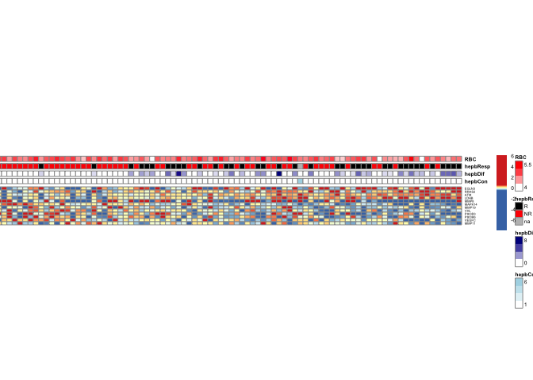

EM131 Fig5e
================
Slim FOURATI
12/09/2014

load require libraries

``` r
suppressPackageStartupMessages(library(package = "knitr"))
suppressPackageStartupMessages(library(package = "Biobase"))
  suppressPackageStartupMessages(library(package = "limma"))
suppressPackageStartupMessages(library(package = "reshape"))
suppressPackageStartupMessages(library(package = "readxl"))
suppressPackageStartupMessages(library(package = "pheatmap"))
suppressPackageStartupMessages(library(package = "tidyverse"))
```

### Set session options

``` r
knitr::opts_chunk$set(echo = TRUE) # do not echo chunks
opts_chunk$set(tidy = FALSE, fig.path = "../figure/")
options(dplyr.summarise.inform = FALSE)
workDir <- workDir <- dirname(getwd())
```

read gene-expression data

``` r
load(file = file.path(workDir, "input", "eset.RData"))
rownames(fData(eset)) <- fData(eset)$"Probe.Set.ID"

# use only V2 sample
esetV2 <- eset[, grep(pattern = "V2", eset$"Sample Name")]
exprsMat <- exprs(esetV2)

# average duplicate
id <- esetV2$"Sample Name"
names(id) <- colnames(exprs(esetV2))
id <- unstack(stack(id)[, 2:1])
exprsMat <- sapply(id, FUN = function(x) {
    rowMeans(exprsMat[, x, drop = FALSE])
})

# extract training set
fileName <- "20120924_Merck.randomization.listPatientID.txt"
randomisationTab <- read.table(file = file.path(workDir,
                                       "input",
                                       fileName),
                                   sep = "\t",
                                   row.names = 1)
pts2set <- strsplit(randomisationTab[, "V2"], split = ",")
names(pts2set) <- rownames(randomisationTab)

# print patients ID affected to training/test sets
pts2set <- stack(pts2set)
sample2set <- pData(eset)[match(colnames(exprsMat),
                                    table = eset$"Sample Name"), "Subject ID"]
sample2set <- match(sample2set, table = pts2set$"values")
sample2set <- pts2set[sample2set, "ind"]

# use expression matrix of training set
exprsMat <- exprsMat[, sample2set %in% "training"]

# create expression w/ training set expression
pdata <- pData(eset)[match(colnames(exprsMat),
                               table = eset$"Sample Name"), ]
fdata <- fData(eset)
colnames(fdata)[colnames(fdata) %in% "Probe.Set.ID"] <- "ProbeID"
colnames(fdata)[colnames(fdata) %in% "Gene.Symbol"] <- "SYMBOL"
rownames(pdata) <- colnames(exprsMat)
esetTrain <- ExpressionSet(assayData   = exprsMat,
                               phenoData   = AnnotatedDataFrame(pdata),
                               featureData = AnnotatedDataFrame(fdata))
```

load fits

``` r
load(file = file.path(workDir, "input", "fits.RData"))
fit2 <- fits[["Hepb_V2"]][["fit2"]]
topT <- topTable(fit = fit2, coef = 2, number = Inf)
geneSymbol <- topT$SYMBOL
geneSymbol <- setdiff(geneSymbol, "---")
topT <- topT[match(geneSymbol, table = topT$SYMBOL), ]
```

# read genesets database

``` r
gmxFile <- file.path(workDir, "input/IPA_CP_R.v2.gmt")
gmxDat <- readLines(con = gmxFile)
gmx <- list()
for(i in 1:length(gmxDat)) {
  gmxLine <- unlist(strsplit(gmxDat[i],split = "\t"))
  gmx[[toupper(gmxLine [[1]])]] <- gmxLine[-(1:2)]
}
```

# read RBC

``` r
  fileName <- "RBC_Hcrit_Hemoglb.csv"
  rbcDF <- read.csv(file = file.path(workDir,
"input",
                        "RBC_Hcrit_Hemoglb.csv"))
  ptsID <- gsub(pattern     = "NIML_([0-9]+)_V2",
                replacement = "\\1",
                colnames(exprsMat))
  rbcDF <- melt(rbcDF[, c("AN_NUM", "PRSDTLTM", "TEST", "RESULT")],
                id = c("AN_NUM", "TEST", "PRSDTLTM"))
  rbcDF <- cast(data = rbcDF, formula = AN_NUM ~ PRSDTLTM + TEST)
  rbcDF <- rbcDF[match(ptsID, table = rbcDF$AN_NUM), ]
  rbcDF <- rbcDF[, grep(pattern = "^Visit 1", colnames(rbcDF))]
  rNames <- colnames(rbcDF)
  rbcDF <- t(rbcDF)
  rownames(rbcDF) <- rNames
  colnames(rbcDF) <- colnames(exprsMat)
  pdata <- pData(esetTrain)
  pdata$RBC <- rbcDF["Visit 1_red blood cell count", ]
  pData(esetTrain) <- pdata
```

# heatamp (supervised)

``` r
  gsName <- "HIF1ALPHA_SIGNALING"
  geneLS <- gmx[["HIF1ALPHA_SIGNALING"]]

  exprsMat <- exprs(esetTrain)
  exprsNR <- exprsMat[, esetTrain$hepbDif %in% 0]
  exprsMat <- exprsMat - rowMeans(exprsNR)
  esetFold <- esetTrain
  exprs(esetFold) <- exprsMat
  esetFold$hepbResp <- as.numeric(esetFold$hepbDif > 0)
  esetFold$hepbResp <- c("0" = "NR", "1" = "R")[as.character(esetFold$hepbResp)]
  esetFold$hepbResp[is.na(esetFold$hepbResp)] <- "na"

  tabS7 <- read_excel(path = file.path(workDir,
                                       "input",
    "20141118_Merck.bioage.TableS6.xlsx"))
  tabS7 <- mutate(tabS7,
                  Pathway = gsub(pattern = " ", replacement = "", Pathway)) %>%
           filter(Pathway %in% names(gmx))
  geneLS <- gmx[[gsName]]
  # intersect with DEG
  modelName <- "Hepb_V2"
  fit2 <- fits[[modelName]][["fit2"]]
  topT <- topTable(fit = fit2, coef = 2, number = Inf)
  topT <- topT[topT$P.Value <= 0.05, ]
  degLS <- strsplit(topT$Gene.Symbol, split = " ")
  degLS <- setdiff(unlist(degLS), "---")
  geneLS <- intersect(geneLS, degLS)
  whichRows <- which(fData(esetFold)$SYMBOL %in% geneLS &
                     featureNames(esetFold) %in% topT$Probe.Set.ID)
  topT <- topT[match(rownames(exprsMat)[whichRows], table = topT$Probe.Set.ID), ]

  rankMean <- apply(exprsMat[whichRows, ] * sign(topT$logFC),
                    MARGIN = 1,
                    FUN    = rank)
  rankMean <- apply(rankMean, MARGIN = 1, FUN = mean)
  whichCols <- order(rankMean)
  whichRows <- whichRows[order(topT$t)]
  annotationColor <- list(hepbCon = c("white", "lightblue"),
                          hepbDif = c("white", "darkblue"),
                          hepbResp = c(R = "black", NR = "red", na = "grey"),
                          RBC = c("white", "red"))

  mat <- exprs(esetFold)[whichRows, whichCols]
  rownames(mat) <- fData(esetFold)$SYMBOL[whichRows]
  colnames(mat) <- pData(esetFold)$"Sample Name"[whichCols]
  
  # remove duplicate
mat <-  mat[order(apply(mat, 1, FUN = var), decreasing = TRUE), ]
mat <- mat[!duplicated(rownames(mat)), ]
 colAnnotDF <- pData(esetFold)[, c("hepbCon",
                                                "hepbDif",
                                 "hepbResp",
                                 "RBC")]
colAnnotDF$"hepbDif"[is.na(colAnnotDF$"hepbDif")] <- 0
  pheatmap(mat = mat,
           breaks         = c(min(exprsMat),
                                                seq(from       = -0.5,
                                                    to         = 0.5,
                                                    length.out = 99),
                                                max(exprsMat)),
           annotation_col = colAnnotDF,
           cluster_cols = FALSE,
                                        clustering_distance_rows = "correlation",
                             clustering_method = "complete",
                             treeheight_row = 0,
                             cellwidth      = 5,
                             cellheight     = 3,
                             scale          = "none",
                             show_colnames  = FALSE,
                             fontsize       = 5,
                             fontsize_row   = 3,
                             annotation_color = annotationColor)
```

<!-- -->

``` r
  fit <- cor.test(rankMean, esetFold$RBC)
  print(fit)
```

    ## 
    ##  Pearson's product-moment correlation
    ## 
    ## data:  rankMean and esetFold$RBC
    ## t = -2.0215, df = 89, p-value = 0.04623
    ## alternative hypothesis: true correlation is not equal to 0
    ## 95 percent confidence interval:
    ##  -0.398282390 -0.003740082
    ## sample estimates:
    ##        cor 
    ## -0.2095235

rbc scatter

``` r
  plotDF <- data.frame(orderCol = 1:length(whichCols),
                       RBC      = esetFold$RBC[whichCols])
ggplot(data = plotDF, mapping = aes(x = orderCol, y = RBC)) +
              geom_point(size = 4) +
              stat_smooth(method = "lm", se = FALSE, size = 3) +
              scale_y_continuous(limit = c(3.5, 6)) +
                theme_bw()
```

    ## `geom_smooth()` using formula 'y ~ x'

<!-- -->
